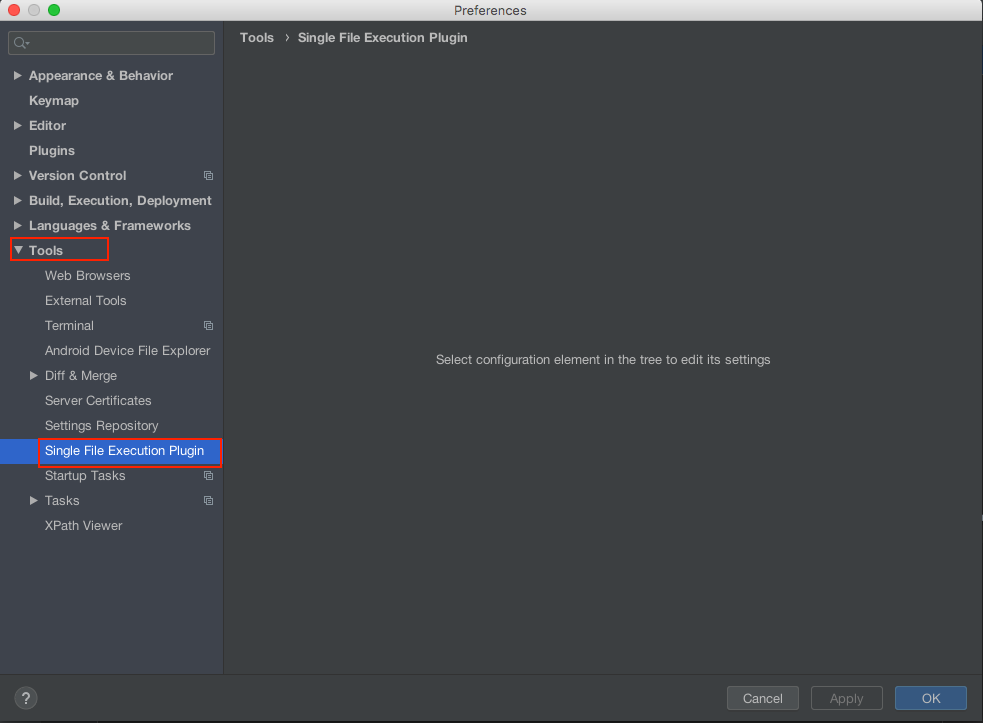
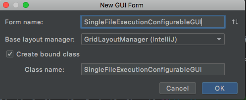
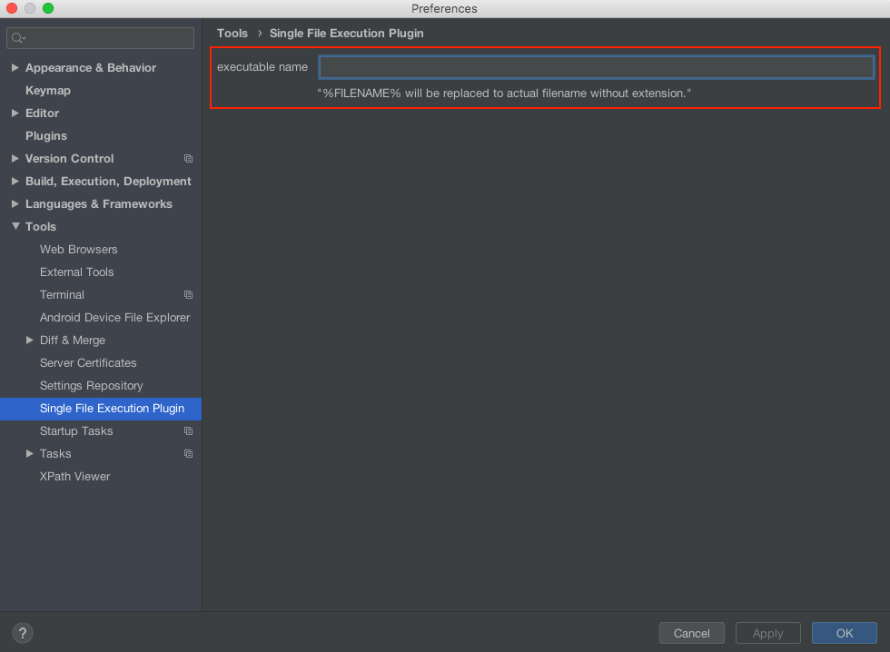

# IntelliJ Plugin Development introduction: ApplicationConfigurable, ProjectConfigurable

* [可配置–将“插件”的配置菜单添加到“设置”对话框](#将插件的配置菜单添加到设置对话框)
* [使类实现Configurable](#使类实现configurable)
* [修改plugin.xml](#修改pluginxml)
* [制作GUI类](#制作gui类)
* [获取项目实例](#获取项目实例)
* [使用PersistentStateComponent保存配置](#使用persistentstatecomponent保存配置)
* [参考文献](#参考文献)

## <a name="将插件的配置菜单添加到设置对话框">可配置–将“插件”的配置菜单添加到“设置”对话框</a>

如果您的插件希望用户允许某些设置，显示配置UI。通过实现`Configurable`，我们可以在IDEA设置对话框中显示它。

* [Customizing the IDEA Settings Dialog](https://confluence.jetbrains.com/display/IDEADEV/Customizing+the+IDEA+Settings+Dialog)
* [Configurable IDEA](https://sites.google.com/site/malenkov/java/150403)

## <a name="使类实现configurable">使类实现Configurable</a>

首先，创建新的Java类 `SingleFileExecutionConfigurable.java`。 让此类实现`SearchableConfigurable`。

`SearchableConfigurable`是`Configurable`的子类，实现Configurable的类可以在“设置”对话框中显示。 您需要重写以下方法来实现此接口。

|function|desc
|---|---
|getDisplayName()|return the name which you want to show on the Settings dialog.<br>Ex. "Single File Execution Plugin"
|getId()|return id<br>Ex "preference.SingleFileExecutionConfigurable"
|createComponent()|You can create GUI component here, and return JComponent.<br>UI component returned here will be shown on the Settings menu.
|isModified()|This is to enable/disable “apply” button in the Setting dialog.<br>Return true when you want to enable “apply” button.<br>您需要实现一种逻辑来检查配置是否已更新，并决定返回true或false
|apply()|It is called when “apply” or “ok” button is pressed.<br>Implement a logic to update configuration.
||
|reset()|It is called when the user clicks the ”Cancel” button<br>Implement a logic to reset the configuration.
|disposeUIResources()|It is called when UI component becomes not necessary.<br>You can implement finalization logic here to release memory.
|enableSearch(String s)|It can be null. You can set some action to be performed when searched.
|getHelpTopic()|Ex "preference.SingleFileExecutionConfigurable"

只需重写这些方法，然后指定显示名称和帮助主题，即可得到骨架代码。
```java
package com.lkl.plugin.configurable;

import com.intellij.openapi.options.ConfigurationException;
import com.intellij.openapi.options.SearchableConfigurable;
import org.jetbrains.annotations.Nls;
import org.jetbrains.annotations.NotNull;
import org.jetbrains.annotations.Nullable;

import javax.swing.*;

public class SingleFileExecutionConfigurable implements SearchableConfigurable {
    @NotNull
    @Override
    public String getId() {
        return "preference.SingleFileExecutionConfigurable";
    }

    @Nls(capitalization = Nls.Capitalization.Title)
    @Override
    public String getDisplayName() {
        return "Single File Execution Plugin";
    }

    @Nullable
    @Override
    public JComponent createComponent() {
        return null;
    }

    @Override
    public boolean isModified() {
        return false;
    }

    @Override
    public void apply() throws ConfigurationException {

    }

    @Nullable
    @Override
    public String getHelpTopic() {
        return "preference.SingleFileExecutionConfigurable";
    }

    @Override
    public void reset() {

    }

    @Override
    public void disposeUIResources() {

    }
}
```

## <a name="修改pluginxml">修改plugin.xml</a>

`plugin.xml`用于声明您插件的模块，类似于Android应用程序的`AndroidManifest.xml`。要使用`Configurable`类，应将以下代码添加到`plugin.xml`中：
```xml
  <extensions defaultExtensionNs="com.intellij">
    <!-- Add your extensions here -->
    <applicationConfigurable 
            groupId="tools" 
            displayName="Single File Execution Plugin" 
            id="preferences.SingleFileExecutionConfigurable" 
            instance="com.lkl.plugin.configurable.SingleFileExecutionConfigurable" />
  </extensions>
```
首先，您需要在`<extensions>`选项中添加声明。您可以为可配置类型选择`applicationConfigurable`或`projectConfigurable`：
* 设置`applicationConfigurable`时，此配置通常用于所有应用程序。
* 设置`projectConfigurable`时，每个项目的配置都是独立的。

对于每个属性，其工作方式如下：

* groupId – Specify the group that your configuration appears. Available parameter is,
  * “root” – ROOT
  * “appearance” – Appearnce & Behavior
  * “editor” – Editor
  * “project” – Default Project / Project Settings
  * “build” – Build, Execution, Deployment
  * “build.tools” – Build Tools
  * “language” – Languages & Frameworks
  * “tools” – Tools
  * “null” – Other Settings
* displayName – Specify display name, should be same with getDisplayName().
* id – unique id
* instance – Specify Configurable class to be instanced.

创建Configurable类并完成plugin.xml的声明后，您可以构建并运行以查看结果：



我们可以看到我们的配置显示出现在设置中的`Tools`选项卡内，`plugin.xml`的`groupId`属性中所指定。目前，该对话框的右侧没有UI，由于`createComponent`方法返回null。

## <a name="制作gui类">制作GUI类</a>

我们要设计用于配置的UI，可以通过GUI形式进行设计。 我们可以通过右键单击`src→New→Swing UI Designer→GUI form`来生成GUI表单，一组JAVA类和表单。 如果您不熟悉IntelliJ插件的UI开发，请查看[“搜索IntelliJ插件开发简介”：GUI表单设计](http://corochann.com/intellij-plugin-development-introduction-gui-form-designing-876.html)



然后设计.form文件使用GUI设计器工具创建自己的GUI。

例如，我放置了`Jlabel`和`JTextField`，以允许用户配置`executable name`。 最后一行的`“Vertical Spacer”`的属性垂直大小策略的值是`“Want Grow”`，用于使其他组件排在最前面。

设计完成后，此处的重要部分是通过在.form文件中指定`“field name”`属性来获取root Panel的实例。设置`field name`后，IntelliJ会在绑定类中自动为此组件创建一个引用，例如，在本示例中，我们获得以下代码：
```java
package com.lkl.plugin.configurable;

import javax.swing.*;

public class SingleFileExecutionConfigurableGUI {
    private JTextField exeNameTextField;
    private JPanel rootPanel;

    SingleFileExecutionConfigurableGUI() {

    }

    public JPanel getRootPanel() {
        return rootPanel;
    }
}
```
> **Note** that I only implement empty `constuctor` and `getRootPanel` method.

您可以通过配置 `File → Settings → Editor > GUI Designer → Generate GUI info → tick “Java source code” (“Binary class files” is selected as default) `来更容易地理解这种关系。

要从`SingleFileExecutionConfigurable`类获取此GUI，请按以下方式实现`createComponent`和`disposeUIResources`：
```java
public class SingleFileExecutionConfigurable implements SearchableConfigurable {
 
    SingleFileExecutionConfigurableGUI mGUI;
 
    @Nullable
    @Override
    public JComponent createComponent() {
        mGUI = new SingleFileExecutionConfigurableGUI();
        return mGUI.getRootPanel();
    }
 
    @Override
    public void disposeUIResources() {
        mGUI = null;
    }
}
```
这就是所有configurable的UI开发的过程，现在您可以看到UI通过构建和运行项目而生效：



## <a name="获取项目实例">获取项目实例</a>

如果您正在开发`ProjectConfigurable`，则可能要获取项目实例。 我们可以通过使用`Project`参数创建一个构造函数来获取实例。
```java
    public SingleFileExecutionConfigurable(@NotNull Project project) {
        // you can get project instance as an argument of constructor
        mProject = project;
        mConfig = SingleFileExecutionConfig.getInstance(project);
    }
```

## <a name="使用persistentstatecomponent保存配置">使用PersistentStateComponent保存配置</a>

最后一步，我们需要将用户的配置保存到存储中。 我们可以使用IntelliJ的PersistentStateComponent来实现。 这与Android平台的首选项相似，因此该值可以xml格式存储，我们可以将这些值提取到JAVA文件中。

有关更多详细信息，[“IntelliJ Plugin Development introduction: PersistStateComponent”](http://corochann.com/intellij-plugin-development-introduction-persiststatecomponent-903.html)

## If you get lost…

有时，关于IntelliJ IDEA插件开发的信息很少，当您不知道如何实现该功能时，查看其他模块的源代码可以帮助您理解。

IntelliJ IDEA社区版源代码在github上开源。 仅举一个例子，在IntelliJ IDEA设置中，您可以在“工具”选项卡中找到`“Terminal”`配置。 可以在[\intellij-community\plugins\terminal\src\org\jetbrains\plugins\terminal](\intellij-community\plugins\terminal\src\org\jetbrains\plugins\terminal)找到此Terminal实现。

## <a name="参考文献">参考文献</a>

[IntelliJ插件开发简介：ApplicationConfigurable，ProjectConfigurable](http://corochann.com/intellij-plugin-development-introduction-applicationconfigurable-projectconfigurable-873.html)

[IntelliJ Plugin Development introduction: GUI form designing](http://corochann.com/intellij-plugin-development-introduction-gui-form-designing-876.html)

[IntelliJ Plugin Development introduction: PersistStateComponent](http://corochann.com/intellij-plugin-development-introduction-persiststatecomponent-903.html)

[SingleFileExecutionPlugin](https://github.com/corochann/SingleFileExecutionPlugin)
