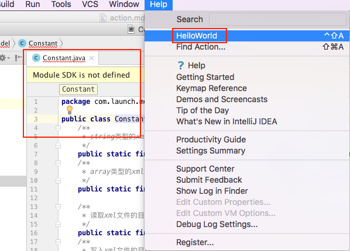
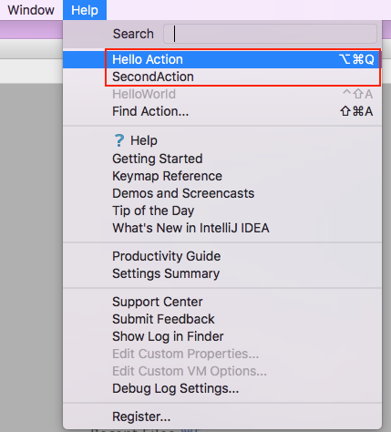
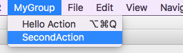
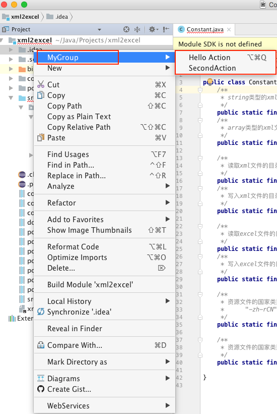
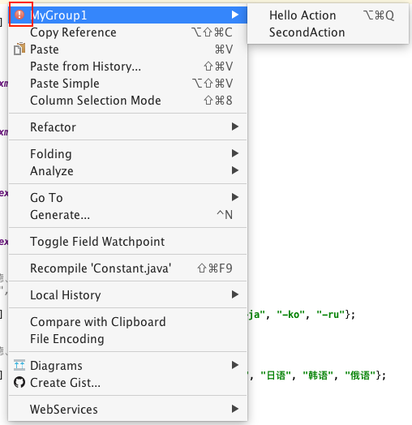

# Action机制

**一个Action本质上来说就是一个Java类，并且这个类需要继承AnAction**。而一个Action对应于一个菜单项，每一次点击这个菜单项就回调这个Action的`actionPerformed(AnActionEvent event)`函数，因此我们定义的Action在继承AnAction时，需要重写`actionPerformed`函数。定义好Action类后，我们需要注册Action，即在plugin.xml文件中添加Action对应的标签，在这个标签中定义了Action应放置在界面的的哪个位置，作为哪个菜单项的子项等。

* [1. 定义Action（继承AnAction）](#定义Action)
  * [1.1 重写actionPerformed函数](#重写actionPerformed函数)
  * [1.2 重写update函数](#重写update函数)
  * [1.3 关于AnActionEvent](#关于AnActionEvent)
* [2. 注册Action（修改plugin.xml）](#注册Action)
  * [2.1 手动注册Action](#手动注册Action)
  * [2.2 IDEA自动注册Action](#IDEA自动注册Action)
  * [2.3 代码动态注册Action](#代码动态注册Action)
* [参考资料](#参考资料)

## <a name="定义Action">1. 定义Action（继承AnAction）</a>

定义Action只需简单地定义一个继承AnAction的子类即可，子类中，最重要的就是`actionPerformed`函数和`update`函数。

### <a name="重写actionPerformed函数">1.1 重写actionPerformed函数</a>

每次在菜单项中点击我们自定义的Action时，对应会执行AnAction的**actionPerformed**函数。当回调**actionPerformed**函数函数时，就意味着当前Action被点击了一次。

重写actionPerformed函数非常简单，例如弹出一个Hello World：
```java
package com.lkl.plugin;

import com.intellij.openapi.actionSystem.AnAction;
import com.intellij.openapi.actionSystem.AnActionEvent;
import com.intellij.openapi.actionSystem.PlatformDataKeys;
import com.intellij.openapi.project.Project;
import com.intellij.openapi.ui.Messages;

/**
 * Created by likunlun on 2020/7/11.
 */
public class HelloWorldPlugin extends AnAction {

    @Override
    public void actionPerformed(AnActionEvent e) {
        // TODO: insert action logic here
        Project project = e.getData(PlatformDataKeys.PROJECT);
        Messages.showMessageDialog(project, "Hello World111!", "Information", Messages.getInformationIcon());
    }
}
```

> 在actionPerformed函数中执行一些逻辑，比如弹出对话框，在打开文件中自动生成代码等等操作。

### <a name="重写update函数">1.2 重写update函数</a>

有时候我们定义的插件只在某些场景中使用。比如说，当我们编写自动生成代码的插件时，只有当有文件打开时才可以正常执行。因此，当我们不希望用户点击我们定义的插件时，我们可以将插件隐藏，让用户无法看到插件，只有当符合插件执行的环境时，才让插件在菜单中显示。

为了能在用户点击自定义插件对应的菜单项之前动态判断是否将插件项显示，只需重写update函数。

> update函数在Action状态发生更新时被回调，当Action状态刷新时，update函数被IDEA回调，并且传递AnActionEvent对象，AnAction对象中封装了当前Action对应的环境。

我们知道，我们定义的每个Action都在菜单中对应一个子选项（为了方便描述，本文称之为Action菜单项），当Action菜单项被点击或者是Action的父菜单（包含Action菜单项的菜单）被点击使得Action菜单项被显示出来时，就会回调update函数。在update被回调时，传入AnActionEvent对象，通过AnActionEvent对象我们可以判断当前编辑框是否已经打开等实时IDEA环境状况。

> **注意**：先执行update函数，再执行actionPerformed函数。换言之，update发生在actionPerformed之前。

比如，我们想要实现：当编辑框被打开时显示自定义的Action菜单项，否则，将Action菜单项设置为灰色。

```java
    @Override
    public void update(AnActionEvent e) {
        Editor editor = e.getData(PlatformDataKeys.EDITOR);

        if (editor != null)
            e.getPresentation().setEnabled(true);
        else
            e.getPresentation().setEnabled(false);

    }
```

代码中，如果 `editor != null`即编辑框已打开，将Action菜单项设置为可用状态（即正常颜色，黑色），否则设置为不可用状态（即灰色）。可以通过`e.getPresentation().setVisible(false);`将Action菜单项设置为不可见，这样Action菜单项就不会出现在菜单中。

当编辑框被打开时（即有文件打开时）：



当编辑框被关闭时（即没有文件被打开时）：


### <a name="关于AnActionEvent">1.3 关于AnActionEvent</a>

AnActionEvent对象是我们与IntelliJ IDEA交互的桥梁，我们可以通过AnActionEvent对象获取当前IntelliJ IDEA的各个模块对象，如编辑框窗口对象、项目窗口对象等，获取到这些对象我们就可以做一些定制的效果。

#### 1.3.1 getData函数

通过`AnActionEvent`对象的`getData`函数可以得到IDEA界面各个窗口对象以及各个窗口为实现某些特定功能的对象。`getData`函数需要传入`DataKey<T>`对象，用于指明想要获取的IDEA中的哪个对象。在`CommonDataKeys`已经定义好各个IDEA对象对应的`DataKey<T>`对象。
```java
public class CommonDataKeys {
    public static final DataKey<Project> PROJECT = DataKey.create("project");
    public static final DataKey<Editor> EDITOR = DataKey.create("editor");
    public static final DataKey<Editor> HOST_EDITOR = DataKey.create("host.editor");
    public static final DataKey<Caret> CARET = DataKey.create("caret");
    public static final DataKey<Editor> EDITOR_EVEN_IF_INACTIVE = DataKey.create("editor.even.if.inactive");
    public static final DataKey<Navigatable> NAVIGATABLE = DataKey.create("Navigatable");
    public static final DataKey<Navigatable[]> NAVIGATABLE_ARRAY = DataKey.create("NavigatableArray");
    public static final DataKey<VirtualFile> VIRTUAL_FILE = DataKey.create("virtualFile");
    public static final DataKey<VirtualFile[]> VIRTUAL_FILE_ARRAY = DataKey.create("virtualFileArray");
    public static final DataKey<PsiElement> PSI_ELEMENT = DataKey.create("psi.Element");
    public static final DataKey<PsiFile> PSI_FILE = DataKey.create("psi.File");
    public static final DataKey<Boolean> EDITOR_VIRTUAL_SPACE = DataKey.create("editor.virtual.space");

    public CommonDataKeys() {
    }
}
```

不仅仅`CommonDataKeys`中定义了`DataKey<T>`对象，为了添加更多的`DataKey<T>`对象并且兼容等，又提供了`PlatformDataKeys`类，`PlatformDataKeys`类是`CommonDataKeys`子类。

```java
public class PlatformDataKeys extends CommonDataKeys {
    public static final DataKey<FileEditor> FILE_EDITOR = DataKey.create("fileEditor");
    public static final DataKey<String> FILE_TEXT = DataKey.create("fileText");
    public static final DataKey<Boolean> IS_MODAL_CONTEXT = DataKey.create("isModalContext");
    public static final DataKey<DiffViewer> DIFF_VIEWER = DataKey.create("diffViewer");
    public static final DataKey<DiffViewer> COMPOSITE_DIFF_VIEWER = DataKey.create("compositeDiffViewer");
    public static final DataKey<String> HELP_ID = DataKey.create("helpId");
    public static final DataKey<Project> PROJECT_CONTEXT = DataKey.create("context.Project");
    public static final DataKey<Component> CONTEXT_COMPONENT = DataKey.create("contextComponent");
    public static final DataKey<CopyProvider> COPY_PROVIDER = DataKey.create("copyProvider");
    public static final DataKey<CutProvider> CUT_PROVIDER = DataKey.create("cutProvider");
    public static final DataKey<PasteProvider> PASTE_PROVIDER = DataKey.create("pasteProvider");
    public static final DataKey<DeleteProvider> DELETE_ELEMENT_PROVIDER = DataKey.create("deleteElementProvider");
    public static final DataKey<Object> SELECTED_ITEM = DataKey.create("selectedItem");
    public static final DataKey<Object[]> SELECTED_ITEMS = DataKey.create("selectedItems");
    public static final DataKey<Rectangle> DOMINANT_HINT_AREA_RECTANGLE = DataKey.create("dominant.hint.rectangle");
    public static final DataKey<ContentManager> CONTENT_MANAGER = DataKey.create("contentManager");
    public static final DataKey<ToolWindow> TOOL_WINDOW = DataKey.create("TOOL_WINDOW");
    public static final DataKey<TreeExpander> TREE_EXPANDER = DataKey.create("treeExpander");
    public static final DataKey<ExporterToTextFile> EXPORTER_TO_TEXT_FILE = DataKey.create("exporterToTextFile");
    public static final DataKey<VirtualFile> PROJECT_FILE_DIRECTORY = DataKey.create("context.ProjectFileDirectory");
    public static final DataKey<Disposable> UI_DISPOSABLE = DataKey.create("ui.disposable");
    public static final DataKey<ContentManager> NONEMPTY_CONTENT_MANAGER = DataKey.create("nonemptyContentManager");
    public static final DataKey<ModalityState> MODALITY_STATE = DataKey.create("ModalityState");
    public static final DataKey<Boolean> SOURCE_NAVIGATION_LOCKED = DataKey.create("sourceNavigationLocked");
    public static final DataKey<String> PREDEFINED_TEXT = DataKey.create("predefined.text.value");
    public static final DataKey<String> SEARCH_INPUT_TEXT = DataKey.create("search.input.text.value");
    public static final DataKey<Object> SPEED_SEARCH_COMPONENT = DataKey.create("speed.search.component.value");
    public static final DataKey<Point> CONTEXT_MENU_POINT = DataKey.create("contextMenuPoint");
    /** @deprecated */
    @Deprecated
    public static final DataKey<Comparator<? super AnAction>> ACTIONS_SORTER = DataKey.create("actionsSorter");

    public PlatformDataKeys() {
    }
}
```

#### 1.3.2 Presentation对象

一个`Presentation`对象表示一个Action在菜单中的外观，通过`Presentation`可以获取Action菜单项的各种属性，如显示的**文本、描述、图标（Icon）**等。并且可以**设置当前Action菜单项的状态、是否可见、显示的文本等等**。通过`AnActionEvent`对象的`getPresentation()`函数可以取得`Presentation`对象。

## <a name="注册Action">2. 注册Action（修改plugin.xml）</a>

注册Action，我们可以手动直接修改plugin.xml文件，也可由IDEA直接自动帮我们生成，甚至是通过代码动态注册。

### <a name="手动注册Action">2.1 手动注册Action</a>

#### [2.1.1 单个Action](./helloWorld.md#pluginxml)

手动注册即我们直接修改`plugin.xml`文件，在`plugin.xml`文件（`resoutces/META-INF/plugin.xml`）中找到`<actions>`标签，并在`<actions>`标签中添加`<action>`标签。

#### 2.1.2 Action组（Action Group）

前面我们都是将一个Action放入到已有的菜单中作为子选项。现在我们定义一个跟Help同级的菜单，或者是定义包含多个子选项的菜单，这就是`Action Group`。使用Action Group非常简单，就是在`<actions>`标签中添加`<group>`子标签，`<group>`标签主要关注3个属性：**id、text、popup**。

* id和text跟<action>标签意义一样，需要注意，**text中如果需要首字母加下划线，则开头下“_”即可**。
* popup属性用于描述是否有子菜单弹出，如果取值为true，则<group>标签的内所有的<action>子标签作为<group>菜单的子选项，否则，<group>标签的内所有的<action>子标签将替换<group>菜单项所在的位置，即没有<group>这一层菜单。

```xml
  <actions>
    <!-- Add your actions here -->
    <group id="IdeaPluginStudy.MyGroup" text="_MyGroup" popup="true">
      <add-to-group group-id="HelpMenu" anchor="first"/>
      <action class="com.lkl.plugin.MyAction" id="IdeaPluginStudy.MyAction" text="Hello Action">
        <keyboard-shortcut keymap="$default" first-keystroke="ctrl alt Q"/>
      </action>
      <action id="IdeaPluginStudy.SecondAction" class="com.lkl.plugin.SecondAction" text="SecondAction"/>
    </group>
  </actions>
```

运行结果如下：


将popup属性改为`false`运行结果如下：



将group-id属性指定为`MainMenu`,运行如下：



可以看到，IDEA的所有的导航菜单都放在`MainMenu`中，我们指定了`anchor="first"`，因此被加入第一个位置。接下来我们再看看将group加入到编辑框窗口右键菜单，只需将group-id属性指定为`EditorPopupMenu`,运行如下：


修改为项目窗口右键菜单，修改group-id为：`ProjectViewPopupMenu`。运行如下：



### <a name="IDEA自动注册Action">2.2 IDEA自动注册Action</a>

直接点击在包目录上[右击 > New > Action](./helloWorld.md#创建Action)。弹出框对应填写属性即可，这样在自动创建Action的同时，完成了Action的注册。

### <a name="代码动态注册Action">2.3 代码动态注册Action</a>

代码动态注册Action主要是以`Action Group`动态添加和移除`Action`。前面我们在使用<group>标签时，没有使用到class属性，即我们没有定义自己的Action Group，而是使用默认的`Action Group（DefaultActionGroup）`。为了定制自己的Action Group，我们定义MyGroup类，使之继承ActionGroup类，并在<group>标签的class属性中指定com.lkl.plugin.MyGroup。

```java
package com.lkl.plugin;

import com.intellij.openapi.actionSystem.ActionGroup;
import com.intellij.openapi.actionSystem.AnAction;
import com.intellij.openapi.actionSystem.AnActionEvent;
import org.jetbrains.annotations.NotNull;
import org.jetbrains.annotations.Nullable;

/**
 * Created by likunlun on 2020/7/11.
 */
public class MyGroup extends ActionGroup {
    @NotNull
    @Override
    public AnAction[] getChildren(@Nullable AnActionEvent anActionEvent) {
        return new AnAction[]{new CustomAction("first"),new CustomAction("second")};
    }

    class CustomAction extends AnAction {
        public CustomAction(String text) {
            super(text);
        }
        @Override
        public void actionPerformed(@NotNull AnActionEvent anActionEvent) {
        }
    }
}
```

plugin.xml文件中对应的`<actions>`标签如下：
```xml
  <actions>
    <!-- Add your actions here -->
    <group id="IdeaPluginStudy.MyGroup" class="com.lkl.plugin.MyGroup" text="_MyGroup" popup="true">
      <add-to-group group-id="MainMenu" anchor="last"/>
    </group>
  </actions>
```

运行结果如下：


如果我们想在plugin.xml中注册Action，并且想修改Group的菜单属性。我们只需重写`DefaultActionGroup`的`update`函数，DefaultActionGroup的update函数与AnAction的update函数意义差不多。例如，我们将Group菜单添加一个图标，代码如下：

```java
package com.lkl.plugin;

import com.intellij.icons.AllIcons;
import com.intellij.openapi.actionSystem.AnActionEvent;
import com.intellij.openapi.actionSystem.CommonDataKeys;
import com.intellij.openapi.actionSystem.DefaultActionGroup;
import com.intellij.openapi.editor.Editor;

/**
 * Created by likunlun on 2020/7/11.
 */
public class MyGroup1 extends DefaultActionGroup {
    @Override
    public void update(AnActionEvent e) {
        Editor editor = e.getData(CommonDataKeys.EDITOR);
        e.getPresentation().setVisible(true);
        e.getPresentation().setEnabled(editor != null);
        e.getPresentation().setIcon(AllIcons.General.Error);
    }
}
```

运行结果如下：



## <a name="参考资料">参考资料</a>

Action System相关类源码（Github）：[《intellij-community》](https://github.com/JetBrains/intellij-community/tree/306d705e1829bd3c74afc2489bfb7ed59d686b84/platform/editor-ui-api/src/com/intellij/openapi/actionSystem)

官网资料：[https://www.jetbrains.org/intellij/sdk/docs/tutorials/action_system.html](https://www.jetbrains.org/intellij/sdk/docs/tutorials/action_system.html)