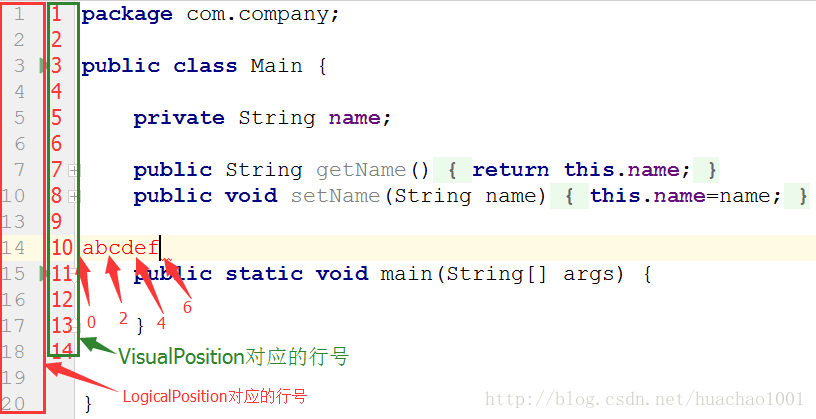

# 插件开发之Editor

我们开发 idea 插件，绝大多数插件功能是用在编辑文本上面，让用户开发更便捷。

* [1. 文本编辑](#文本编辑)
  * [1.1 CaretModel和SelectionModel](#CaretModel和SelectionModel)
    * [1.1.1 CaretModel对象](#CaretModel对象)
    * [1.1.2 SelectionModel对象](#SelectionModel对象)
  * [1.2 Document对象](#Document对象)
  * [1.3 实现自动生成Getter和Setter函数的插件](#实现自动生成Getter和Setter函数的插件)
* [2. Editor的坐标系统：位置和偏移量](#Editor的坐标系统位置和偏移量)
* [3. Editor中的按键事件](#Editor中的按键事件)


## <a name="文本编辑">1. 文本编辑</a>
### <a name="CaretModel和SelectionModel">1.1 CaretModel和SelectionModel</a>

为了能够更灵活地控制Editor，IDEA插件开发中将Editor细分为多个模型：
* CaretModel
* SelectionModel
* FoldingModel
* IndentsModel
* ScrollingModel
* ScrollingModel
* SoftWrapModel

获取Editor的`CaretModel`和`SelectionModel`对象方法如下：
```java
    @Override
    public void actionPerformed(AnActionEvent e) {
        Editor editor = e.getData(PlatformDataKeys.EDITOR);
        if (editor == null)
            return;

        SelectionModel selectionModel = editor.getSelectionModel();
        CaretModel caretModel=editor.getCaretModel();
    }
```

其他模型对象获取方式类似，通过Editor对象的相应函数即可得到。

#### <a name="CaretModel对象">1.1.1 CaretModel对象</a>

CaretModel对象用于描述插入光标，通过CaretModel对象，可以实现如下功能：

|function|desc
|---|---
|moveToOffset(int offset)|将光标移动到指定位置（offset）
|getOffset()|获取当前光标位置偏移量
|getCaretCount|获取光标数量（可能有多个位置有光标）
|void addCaretListener(CaretListener listener) <br>void removeCaretListener(CaretListener listener)|添加或移除光标监听器（CareListener）
|Caret addCaret(VisualPosition visualPosition)|加入新的光标
|…|…|

#### <a name="SelectionModel对象">1.1.2 SelectionModel对象</a>
SelectionModel对象用于描述光标选中的文本段，通过`SelectionModel`对象可以实现如下功能：

|function|desc
|---|---
|String getSelectedText() |获取选中部分字符串。
|int getSelectionEnd()|获取选中文本段末尾偏移量
|int getSelectionStart()|获取选中文本段起始位置偏移量
|void setSelection(int start, int end)|设置选中，将start到end部分设置为选中
|void removeSelection()|将选中文本段删除
|void addSelectionListener(SelectionListener listener)|添加监听器，用于监听光标选中变化。
|void selectLineAtCaret()|将光标所在的行设置为选中。
|void selectWordAtCaret(boolean honorCamelWordsSettings)|将光标所在的单词设置为选中。honorCamelWordsSettings表示是否驼峰命名分隔，如果为true，则大写字母为单词的边界
|…|…

### <a name="Document对象">1.2 Document对象</a>

与Editor中的其他对象一样，通过Editor对象的一个getter函数即可得到Document对象：

> Document document = editor.getDocument();

**Document对象用于描述文档文件**，通过Document对象可以很方便的对Editor中的文件进行操作。可以做如下这些事情：

|function|desc
|---|---
|String getText()<br>String getText(TextRange range)|获取Document对象对应的文件字符串。
|int getTextLength()|获取文件长度。
|int getLineCount()|获取文件的行数
|int getLineNumber(int offset)|获取指定偏移量位置对应的行号offset取值为\[0,getTextLength()-1\]。
|int getLineStartOffset(int line)|获取指定行的第一个字符在全文中的偏移量，行号的取值范围为：\[0,getLineCount()-1\]
|int getLineEndOffset(int line)|获取指定行的最后一个字符在全文中的偏移量，行号的取值范围为：\[0,getLineCount()-1\]
|void insertString(int offset, CharSequence s)|在指定偏移位置插入字符串
|void deleteString(int startOffset, int endOffset)|删除\[startOffset,endOffset\]位置的字符串，如果文件为只读，则会抛异常。
|void replaceString(int startOffset, int endOffset, CharSequence s)|替换\[startOffset,endOffset\]位置的字符串为s
|void addDocumentListener( DocumentListener listener)|添加Document监听器，在Document内容发生变化之前和变化之后都会回调相应函数。
|…|…

### <a name="实现自动生成Getter和Setter函数的插件">1.3 实现自动生成Getter和Setter函数的插件</a>

首先创建一个Action，名为GetterAndSetter，并在plugin.xml中注册。plugin.xml的<acitons>标签部分如下：

```xml
  <actions>
    <!-- Add your actions here -->
    <action id="IdeaPluginStudy.GetterAndSetter" class="com.lkl.plugin.base.GetterAndSetter" text="Getter And Setter"
            description="生成Getter和Setter方法">
      <add-to-group group-id="EditorPopupMenu" anchor="first"/>
      <keyboard-shortcut keymap="$default" first-keystroke="ctrl alt G"/>
    </action>
  </actions>
```

定义Action时需要重写actionPerformed和update函数：
```java
    @Override
    public void actionPerformed(AnActionEvent e) {
        //获取Editor和Project对象
        Editor editor = e.getData(PlatformDataKeys.EDITOR);
        Project project = e.getData(PlatformDataKeys.PROJECT);
        if (editor == null||project==null)
            return;

        //获取SelectionModel和Document对象
        SelectionModel selectionModel = editor.getSelectionModel();
        Document document = editor.getDocument();

        //拿到选中部分字符串
        String selectedText = selectionModel.getSelectedText();

        //得到选中字符串的起始和结束位置
        int startOffset = selectionModel.getSelectionStart();
        int endOffset = selectionModel.getSelectionEnd();

        //得到最大插入字符串（即生成的Getter和Setter函数字符串）位置
        int maxOffset = document.getTextLength() - 1;

        //计算选中字符串所在的行号，并通过行号得到下一行的第一个字符的起始偏移量
        int curLineNumber = document.getLineNumber(endOffset);
        int nextLineStartOffset = document.getLineStartOffset(curLineNumber + 1);

        //计算字符串的插入位置
        int insertOffset = maxOffset > nextLineStartOffset ? nextLineStartOffset : maxOffset;

        //得到选中字符串在Java类中对应的字段的类型
        String type = getSelectedType(document, startOffset);

        //对文档进行操作部分代码，需要放入Runnable接口中实现，由IDEA在内部将其通过一个新线程执行
        Runnable runnable = new Runnable() {
            @Override
            public void run() {
                //genGetterAndSetter为生成getter和setter函数部分
                document.insertString(insertOffset, genGetterAndSetter(selectedText, type));
            }
        };

        //加入任务，由IDEA调度执行这个任务
        WriteCommandAction.runWriteCommandAction(project, runnable);

    }

    @Override
    public void update(AnActionEvent e) {
        Editor editor = e.getData(PlatformDataKeys.EDITOR);
        SelectionModel selectionModel = editor.getSelectionModel();

        //如果没有字符串被选中，那么无需显示该Action
        e.getPresentation().setVisible(editor != null && selectionModel.hasSelection());
    }
```

剩下的还有获取选中字段的类型和生成Getter、Setter函数两个部分，两个函数如下：

```java
    private String getSelectedType(Document document, int startOffset) {

        String text = document.getText().substring(0, startOffset).trim();
        int startIndex = text.lastIndexOf(' ');

        return text.substring(startIndex + 1);
    }

    private String genGetterAndSetter(String field, String type) {
        if (field == null || (field = field.trim()).equals(""))
            return "";
        String upperField = field;
        char first = field.charAt(0);
        if (first <= 'z' && first >= 'a') {
            upperField = String.valueOf(first).toUpperCase() + field.substring(1);
        }
        String getter = "\tpublic TYPE getUpperField(){ \n\t\treturn this.FIELD;\n\t}";
        String setter = "\tpublic void setUpperField(TYPE FIELD){\n\t\tthis.FIELD=FIELD;\n\t}";

        String myGetter = getter.replaceAll("TYPE", type).replaceAll("UpperField", upperField).replaceAll("FIELD", field);
        String mySetter = setter.replaceAll("TYPE", type).replaceAll("UpperField", upperField).replaceAll("FIELD", field);

        return "\n"+myGetter + "\n" + mySetter + "\n";
    }
```

> **注意**：在对Document进行修改时，需要实现Runnable接口并将修改部分代码写入run函数中，最后通过 WriteCommandAction的runWriteCommandAction函数执行。

## <a name="Editor的坐标系统位置和偏移量">2. Editor的坐标系统：位置和偏移量</a>

通过CaretModel对象我们可以获取当前光标位置。但在Editor中位置分为两种：
* 一种是逻辑位置，对应`LogicalPosition`类；
* 一种是视觉位置，对应`VisualPosition`类。



上图中，光标的坐标为：

> LogicalPosition：(13,6)
>
> VisualPosition：(9,6)

**注意**，行号和列号都是从0开始。

获取`LogicalPosition`和`VisualPosition`方法如下：

```java
@Override
public void actionPerformed(AnActionEvent e) {
    //获取Editor和Project对象
    Editor editor = e.getData(PlatformDataKeys.EDITOR);
    Project project = e.getData(PlatformDataKeys.PROJECT);
    if (editor == null || project == null)
        return;
    CaretModel caretModel = editor.getCaretModel();
    LogicalPosition logicalPosition = caretModel.getLogicalPosition();
    VisualPosition visualPosition = caretModel.getVisualPosition();

    System.out.println(logicalPosition + "," + visualPosition);
}
```

## <a name="Editor中的按键事件">3. Editor中的按键事件</a>

为了监听按键事件，专门提供了`TypedActionHandler`类，我们只需继承`TypedActionHandler`，并重写`execute`函数即可。注意，只能监听可打印字符对应的按键。

```java
package com.lkl.plugin.base;

import com.intellij.openapi.actionSystem.DataContext;
import com.intellij.openapi.editor.Editor;
import com.intellij.openapi.editor.actionSystem.TypedActionHandler;
import org.jetbrains.annotations.NotNull;

/**
 * Created by likunlun on 2020/7/11.
 */
public class MyTypedActionHandler implements TypedActionHandler {
    @Override
    public void execute(@NotNull Editor editor, char c, @NotNull DataContext dataContext) {
        System.out.println(c);
    }
}
```

`TypedAction`专门处理按键相关操作，定义了`TypedActionHandler`后，接下来就是将自定义的`TypedActionHandler`加入到`TypedAction`中：

```java
final EditorActionManager actionManager = EditorActionManager.getInstance();
final TypedAction typedAction = actionManager.getTypedAction();
typedAction.setupHandler(new MyTypedActionHandler());
```
把上面这段代码加入到Action的构造函数中，或者是在Action中创建static块。

> **注意**：只能设置一个监听，如果自定义了按键监听，而不做其他处理的话，会使得原先IDEA中的按键监听无法处理，导致无法正常在输入框中输入。

实现一个简单功能的插件：在输入字符的同时，在文档的开头也插入同样的字符。

首先定义`TypedActionHandler`：

```java
public class MyTypedActionHandler implements TypedActionHandler {
    private TypedActionHandler oldHandler;
    private boolean isBegin = true;
    private int caretLine = 0;

    @Override
    public void execute(@NotNull Editor editor, char c, @NotNull DataContext dataContext) {
        if (oldHandler != null)
            oldHandler.execute(editor, c, dataContext);

        Document document = editor.getDocument();
        CaretModel caretModel = editor.getCaretModel();
        int caretOffset = caretModel.getOffset();
        int line = document.getLineNumber(caretOffset);
        if (isBegin) {
            document.insertString(document.getLineStartOffset(line), String.valueOf(c) + "\n");
            caretLine = line + 1;
            isBegin = false;
        } else {
            if (line != caretLine) {
                isBegin = true;
                execute(editor, c, dataContext);
            } else {
                document.insertString(document.getLineEndOffset(line - 1), String.valueOf(c));
            }
        }
        System.out.println(caretLine + "," + line);

    }

    public void setOldHandler(TypedActionHandler oldHandler) {
        this.oldHandler = oldHandler;
    }
}
```

将我们定义的TypedActionHandler设置进去，实现一个Action：
```java
public class InsertCharAction extends AnAction {
    public InsertCharAction() {
        final EditorActionManager actionManager = EditorActionManager.getInstance();
        final TypedAction typedAction = actionManager.getTypedAction();
        MyTypedActionHandler handler = new MyTypedActionHandler();
        //将自定义的TypedActionHandler设置进去后，
        //返回旧的TypedActionHandler，即IDEA自身的TypedActionHandler
        TypedActionHandler oldHandler = typedAction.setupHandler(handler);
        handler.setOldHandler(oldHandler);
    }

    @Override
    public void actionPerformed(AnActionEvent e) {

    }
}
```

