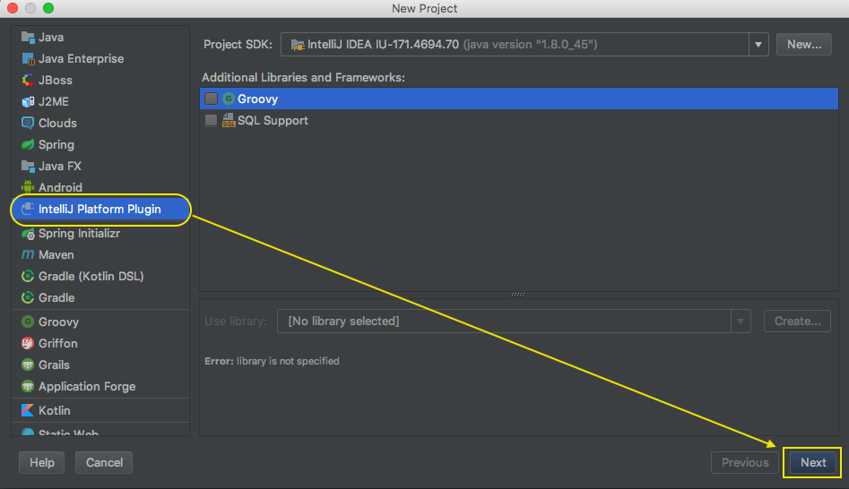
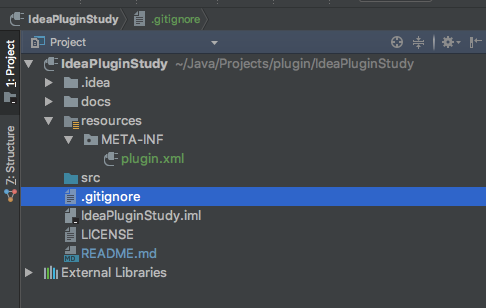
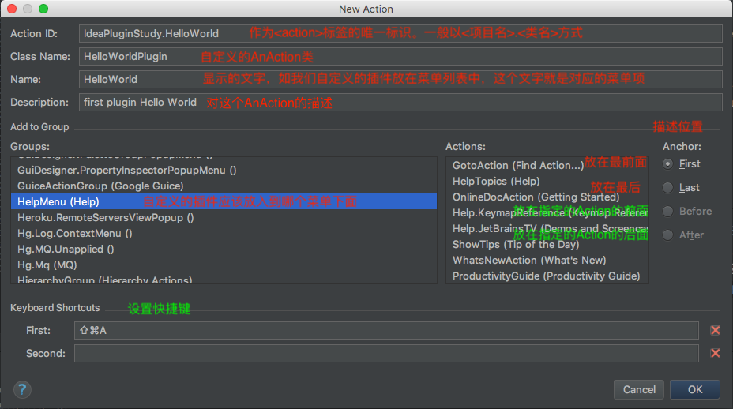
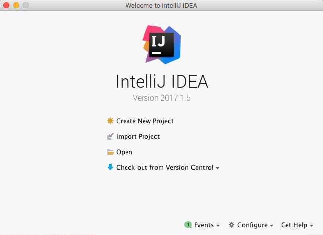
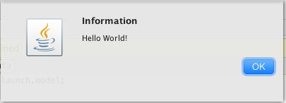
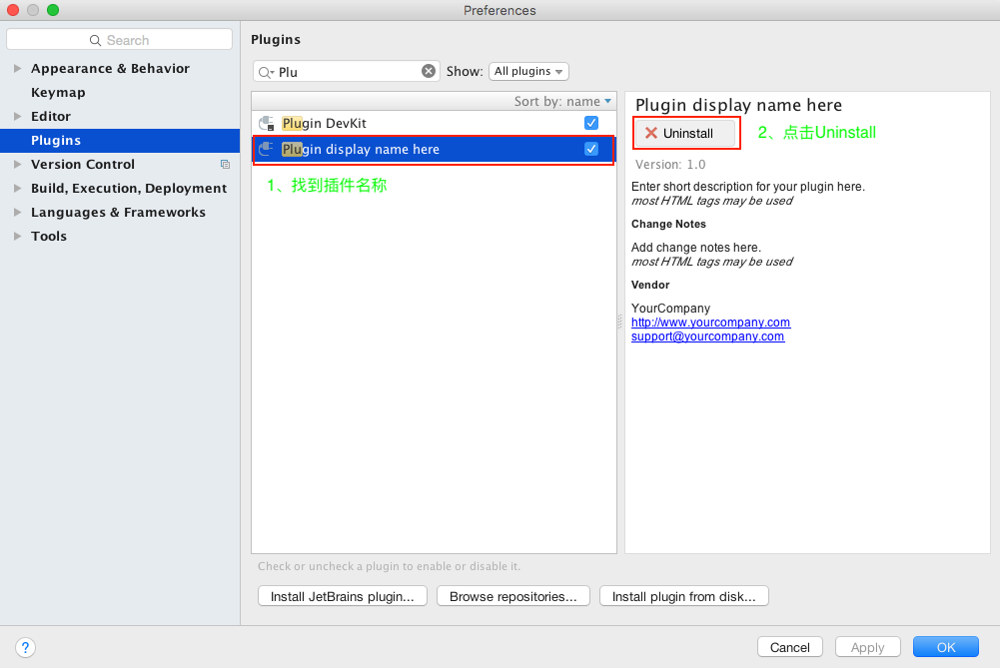
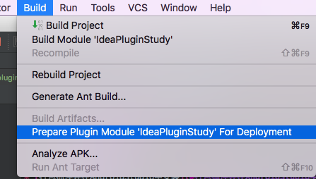

# 编写你的第一个plugin Hello World

编程入门从Hello World开始。

* [下载IntelliJ IDEA](#下载IntelliJIDEA)
* [创建项目](#创建项目)
* [创建Action](#创建Action)
* [plugin.xml](#pluginxml)
* [运行](#运行)
* [卸载插件](#卸载插件)
* [打包插件并在AndroidStudio中安装](#打包插件并在AndroidStudio中安装)

通常我们开发的IntelliJ平台插件主要分为如下几类：

* **自定义编程语言的支持（Custom language support）**：包括语法高亮、文件类型识别、代码格式化、代码查看和自动补全等等
* **框架集成（Framework integration）**：其实就是类似基于IntelliJ开发一个IDE出来，比如AndroidStudio 将Android SDK集成进IntelliJ。其他的插件如Java EE中的Spring、Struts等framework集成到IntelliJ。使用户在IntelliJ上面使用特定的框架更方便。
* **工具集成（Tool integration）**：对IntelliJ定制一些个性化或者是实用的工具。
* **附加UI（User interface add-ons）**：对标准的UI界面进行修改，如在编辑框里加一个背景图片等。

## <a name="下载IntelliJIDEA">下载IntelliJ IDEA</a>

> https://www.jetbrains.com/idea/

## <a name="创建项目">创建项目</a>

选择“**File>New>Project…**”,将Project选择为**IntelliJ Platform Plugin**，然后再点击Next。如下图所示：



填写Project名称及项目保存路径，其中Project Name可以认为是插件名称。点击Finish，如下图所示：


完成后，创建的项目结构如下所示：



我们比较关心的主要是`src`目录和`resources/META-INF/plugin.xml`文件。`src`目录存放的是插件对应的Java源码，`resources/META-INF/plugin.xml`是配置Action的文件，关于Action后面讲，现在暂时可以将`resources/META-INF/plugin.xml`看成是插件的配置文件。

## <a name="创建Action">创建Action</a>

我们在IntelliJ自定义的插件可以添加到菜单项目（如右键菜单中）或者是放在工具栏中。当用户点击时触发一个动作事件，IntelliJ则会回调`AnAction`类的`actionPerformed`函数。因此我们只需重写`actionPerformed`函数即可。
在`src`目录中创建包名：`com.lkl.plugin`,然后，在`com.lkl.plugin`中右键 New -> Action 创建一个Action，类为HelloWorldPlugin.java，如下图所示：



HelloWorldPlugin继承`AnAction`类，并重写`actionPerformed`函数

```java
package com.lkl.plugin.base;

import com.intellij.openapi.actionSystem.AnAction;
import com.intellij.openapi.actionSystem.AnActionEvent;
import com.intellij.openapi.actionSystem.PlatformDataKeys;
import com.intellij.openapi.project.Project;
import com.intellij.openapi.ui.Messages;

/**
 * Created by likunlun on 2020/7/11.
 */
public class HelloWorldPlugin extends AnAction {

    @Override
    public void actionPerformed(AnActionEvent e) {
        // TODO: insert action logic here
        Project project = e.getData(PlatformDataKeys.PROJECT);
        Messages.showMessageDialog(project, "Hello World!", "Information", Messages.getInformationIcon());
    }
}
```

## <a name="pluginxml">plugin.xml</a>

通过上一步生成的Action会在`plugin.xml`中的`<actions>`标签中添加`<action>`子标签，如下所示：
                                      
```xml
  <actions>
    <!-- Add your actions here -->
    <action id="IdeaPluginStudy.HelloWorld" class="com.lkl.plugin.base.HelloWorldPlugin" text="HelloWorld"
            description="first plugin Hello World">
      <add-to-group group-id="HelpMenu" anchor="first"/>
      <keyboard-shortcut keymap="$default" first-keystroke="shift meta A"/>
    </action>
  </actions>
```

<font color=red>`<action>`</font>标签属性的简单说明：

> **id**：作为`<action>`标签的唯一标识。一般以`<项目名>.<类名>`方式。
>
> **class**：即我们自定义的`AnAction`类
>
> **text**：显示的文字，如我们自定义的插件放在菜单列表中，这个文字就是对应的菜单项
>
> **description**：对这个`AnAction`的描述


另外还有`<add-to-group>`标签，这个标签指定我们自定义的插件应该放入到哪个菜单下面。在IntelliJ IDEA菜单栏中有很多菜单如File、Edit、View、Navigate、Code、……、Help等。他们的ID一般是菜单名+Menu的方式。比如，我们想将我们自定义的插件放到Help菜单中，作为Help菜单的子选项。那么在`<add-to-group>`标签中指定`group-id="HelpMenu"`。`<add-to-group>`标签的anchor属性用于描述位置，主要有四个选项：`first、last、before、after`。他们的含义如下：

> first：放在最前面
> 
> last：放在最后
> 
> before：放在relative-to-action属性指定的ID的前面
> 
> after：放在relative-to-action属性指定的ID的后面

<font color=red>`relative-to-action`</font>也是<font color=red>`<add-to-group>`</font>的属性。

`<keyboard-shortcut>`标签用于描述快捷键，主要关注2个属性：`keymap`和`first-keystroke`。`keymap`使用默认值（`$default`）就好，`first-keystroke`用于指定快捷键。

## <a name="运行">运行</a>

点击运行。会发现，运行时是自动再启动新的IntelliJ IDEA。而新启动的IntelliJ IDEA由于没有可打开的项目会停留在如下界面：



为了能查看到我们的插件，可以点击<font color=red>Create New Project</font>或者是导入项目，总之，让它正确进入到开发界面就好。

接下来，点击help菜单，会看到如下：


点击·”HelloWorld”项，运行如下：



## <a name="卸载插件">卸载插件</a>

当我们按照上面的方面再创建一个插件时，发现上一次的插件还会出现。而且我们创建的新的插件不会出现，这是什么原因呢？这主要是，我们没有修改插件名称，并且没有修改版本。这样的话自然就没有覆盖原先的插件了。

因此我们有2种方法：
* 第一种就是将原来的插件卸载
* 第二种就是将新建的插件名称与原先的区分开来（在plugin.xml中 <name>标签中指定）

将原来的插件卸载，首先，点击“File>Settings>Plugins”，如下图：



找到插件名称，这里也就是`“Plugin display name here”`,因为一开始我们没有修改插件名称，这个名词是自动生成的。然后点击`Uninstall`，最后重启或者是关闭IntelliJ IDEA完成卸载。

## <a name="打包插件并在AndroidStudio中安装">打包插件并在AndroidStudio中安装</a>

在IntelliJ中打包。点击`“Build > Prepare Plugin Module 'IdeaPluginStudy' For Deployment”`，如下图：



这时在 IdeaPluginStudy 项目中多了一个`IdeaPluginStudy.jar`文件，如下图：


这个文件即为我们导出的插件。接下来打开AndroidStudio，点击`“File>Settings>Plugins”`


点击“install plugin from disk…”,将 IdeaPluginStudy.jar包加入即可完成安装。