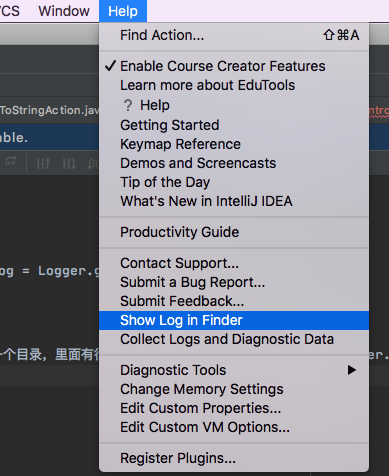

# 打印日志，查看日志

## 创建log对象
```java
import com.intellij.openapi.diagnostic.Logger;

protected static final Logger log = Logger.getInstance(xxx.class);
```

## 查看日志

点击`『showlog in finder』`，会打开一个目录，里面有很多的log文件，你在plugin工程中使用Logger.info打印的日志都会存储在该log文件中，打开即可

