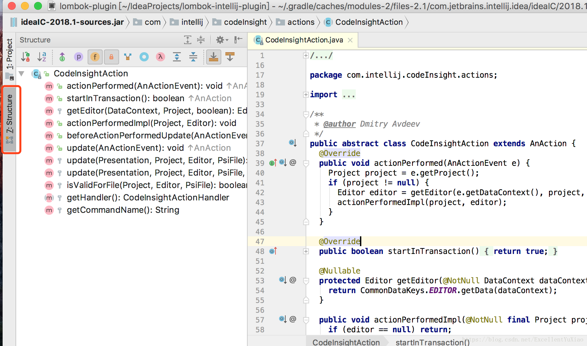

# StructureViewExtension

顾名思义，IDEA提供的这个扩展接口就是为了对其提供的Structure功能进行扩展，同样以lombok项目为例，Structcture中能够清晰明了的显示当前类的结构，如下图所示：



`Structcture`中详细显示当前类中的字段和方法，如果我们通过PsiAugmentProvider提供了相关的字段和方法，如果没有继承`StructureViewExtension`并重写其相关的方法，那么在如图所示的structure结构中就不会显示相关的字段和方法。所以一般使用了`PsiAugmentProvider`都需要再继承`StructureViewExtension`并重写相应的方法。

`StructureViewExtension`接口中字段和方法如下：
```java
  ExtensionPointName<StructureViewExtension> EXTENSION_POINT_NAME = ExtensionPointName.create("com.intellij.lang.structureViewExtension");

  Class<? extends PsiElement> getType();

  StructureViewTreeElement[] getChildren(PsiElement parent);
  
  @Nullable
  Object getCurrentEditorElement(Editor editor, PsiElement parent);
```
* **EXTENSION_POINT_NAME**字段是创建一个扩展点，用于在plugin.xml中配置使用
* **getType()**：获得具体的类型，一般为PsiClass.class
* **getCurrentEditorElement()**：由于只查看相应的结构，不需要获得编辑对象，返回nulll即可
* **getChildren()**：获得子元素，还记得在PsiAugmentProvider中我们通过LightFieldBuilder或者LightMethodBuilder来创建字段或者对象么；如果需要扩展StructureViewExtension，这里可以继承LightFieldBuilder或者LightMethodBuilder来创建相应的方法，getChildren()中遍历字段和方法，通过instanceof判断是否是为具体的对象，如果是则加入到result列表中即可

```java
    @Override
    public StructureViewTreeElement[] getChildren(PsiElement parent) {
        Collection<StructureViewTreeElement> result = new ArrayList<StructureViewTreeElement>();
        final PsiClass psiClass = (PsiClass) parent;

        for (PsiField psiField : psiClass.getFields()) {
            if (psiField instanceof LombokLightFieldBuilder) {
                result.add(new PsiFieldTreeElement(psiField, false));
            }
        }

        for (PsiMethod psiMethod : psiClass.getMethods()) {
            if (psiMethod instanceof LombokLightMethodBuilder) {
                result.add(new PsiMethodTreeElement(psiMethod, false));
            }
        }

        for (PsiClass psiInnerClass : psiClass.getInnerClasses()) {
            if (psiInnerClass instanceof LombokLightClassBuilder) {
                result.add(new JavaClassTreeElement(psiInnerClass, false, new HashSet<PsiClass>() {{
                    add(psiClass);
                }}));
            }
        }

        if (!result.isEmpty()) {
            return result.toArray(new StructureViewTreeElement[result.size()]);
        } else {
            return StructureViewTreeElement.EMPTY_ARRAY;
        }
    }
```

## <a name="参考文献">参考文献</a>

[IntelliJ IDEA插件开发指南(二)](https://blog.csdn.net/ExcellentYuXiao/article/details/80273347)
